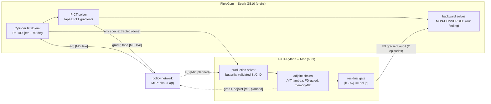

# FluidGym parity: scoping the adjoint-DPC paper

Target: reproduce FluidGym's DPC result on `CylinderJet2D-easy-v0`, then beat
its horizon limitation -- the hypothesis being that their DPC's 7.2% (vs
SAC's 8%) is horizon-truncation, which a memory-flat adjoint removes.

## The environment, extracted from source (repo @ 2026-09-13, code == spec)

| item | value (easy) | medium / hard |
|---|---|---|
| Reynolds number | 100 | 250 / 500 |
| angular resolution | 24 | 32 / 32 |
| solver dt | 1e-2 (adaptive CFL 0.8) | same |
| control interval | step_length 0.25 t.u. = 25 solver steps per action | same |
| episode | 80 env steps = 20 t.u. ~ 3.3 shedding periods | same |
| jets | opposing, top/bottom (+-90 deg), half-width 10 deg, fixed smooth profile x scalar action | same |
| action | ONE scalar (SARL) scaling both jet profiles (opposing signs) | same |
| sensors | 151 wake/near probes x (u, v) = 302 (irrelevant for adjoint control) | same |
| reward | r = C_D,ref - <C_D>_0.25 - 1.0 * |<C_L>_0.25| | same |
| baselines | SAC ~8% drag reduction; DPC ~7.2%, 1-2 orders faster | -- |

Lineage: Rabault et al. JFM 2019 / Ren, Rabault & Tang PoF 2021 -- the same
configuration family as our validated butterfly campaign (Re 100 shedding,
C_D ~ 1.32, St ~ 0.167 at our confinement).

## What we already have

- The physics regime, validated four ways (R11-R13 closing table) with
  quantified blockage laws -- environment ground truth with a pedigree.
- Differentiable force objective: Stage 8 (10/10) -- torch `surface_force`,
  dC_D/d(actuation) through a wall-bounded chain (8.6), the tangential-only
  loss guard (8.3), Dong non-singular solve (8.7/8.8).
- Verified adjoint machinery through every production ingredient: seams,
  BCs, Dong, persistent state (Stage 7, 9/9), DC cross solve (7b, 6/6),
  butterfly topology (6.9, 7/7).
- Jet actuation is a small addition to `cylinder_rect_bc`: Dirichlet arcs at
  +-90 deg +-10 deg on the ring wall faces, profile x a(t) -- same machinery
  as the slip/pin treatments.

## The two honest gaps

1. **The dynamics chains are SCALAR.** `MultiBlockMiniPISO` and descendants
   evolve one field; the force objective is vector but the differentiable
   rollout is not. Full-vector NS differentiable rollout is the outstanding
   build (it IS the plan's Stage 9/10 substrate). Options: (a) extend the
   chain family to (u, v, w, p) -- mechanical but sizeable, all gates
   re-run; (b) adjoint of the PRODUCTION solver step (harder, but then the
   physics is exactly R11's). (a) first: the chain architecture and its
   gate style transfer directly.
2. **The horizon hypothesis has a cheaper competitor.** Their tape's
   across-step memory growth can be attacked with plain gradient
   checkpointing inside THEIR stack (O(sqrt T) memory, 2x compute). If
   FluidGym's DPC merely never enabled checkpointing, the "memory-flat
   adjoint enables long horizons" claim weakens to an efficiency argument.
   MUST be settled empirically before building: run their DPC with torch
   checkpointing at 2-4x horizon on easy; if the 7.2 -> 8% gap closes there,
   the paper pivots to the verified-gradients + validated-environments
   contribution (still publishable, smaller).

## Milestones

  M0  settle gap 2: their DPC + checkpointing at longer horizons (their
      stack, GPU box). Decision gate for the whole framing.
  M1  vector NS chain (u,v,p in 2D first) + gates (FD, seam, BC, forces
      loss) -- the Stage 9/10 substrate regardless of M0's outcome.
  M2  jet actuation in bc module + dC_D/da through the vector chain on the
      butterfly; open-loop optimal a(t) at Re 100 (our own physics, our
      figures).
  M3  FluidGym env parity run: match DPC 7.2% at their horizon, then extend
      horizon at flat memory; report against their published curves.
  M4  the 3D/TCF frontier (their declared future work) if M3 lands.

## M0 setup: DONE (2026-09-13) -- FluidGym runs and differentiates on the GB10

Recipe (tools/fluidgym/Dockerfile, image `fluidgym:m0` on Spark): no aarch64
wheel exists on PyPI, so source-build in `cuda:12.8.1-cudnn-devel` with torch
2.9 cu128 aarch64 wheels and **TORCH_CUDA_ARCH_LIST="12.0"** -- nvcc 12.8
rejects compute_121; same-major SASS compatibility runs sm_120 kernels on the
sm_121 GB10 (the AmgX lesson, re-earned in miniature). Runtime deps installed
explicitly (the source install skipped them). Smoke (tools/fluidgym/
m0_smoke.py): env builds + resets (initial domain from HF hub), uncontrolled
steps step, and differentiable mode returns d(reward)/d(action) = -1.845
end-to-end. Actions must be torch CUDA tensors, not numpy.

Next: the M0 experiment proper -- DPC at their horizon (reproduce ~7.2%),
then 2-4x horizon with torch gradient checkpointing. Decision gate per the
milestones above.

## M0 first light (2026-09-13): the smoke run's four findings

DPC trainer written (tools/fluidgym/dpc_train.py -- truncated-BPTT policy
mode + open-loop sequence mode; neither platform ships trainers, which is
the field norm: HydroGym likewise ships environments + SB3 examples only,
and its differentiable coverage is 4 of 60+ envs vs FluidGym's full suite).
Uncontrolled baseline on CylinderJet2D-easy: drag 3.3281 +/- 0.0004 (their
normalization), episode reward -62.48. Smoke (H=8, 15 iters):

1. Learning works: training reward -62.5 -> -29.3 in 15 iterations.
2. Eval regressed (drag 3.67) -- expected at 15 iters; the sweep decides.
3. **Their backward linear solves DO NOT CONVERGE**: "Linear solve (BWD)
   did not converge after 5000 iterations" / "CG residual rising ... using
   best result" throughout training. The adjoint solves in PISOtorch_diff
   hit caps and silently return best-effort iterates -- UNVERIFIED
   gradients, the exact failure class the caller-side residual gate exists
   for (and the same silent-degradation family as the AmgX status saga).
   Front-page motivation for the verified-gradients framing, observed in
   their own stack on the first training run.
4. Cost/memory: 215 s/iteration (episode-bound, H-independent); peak memory
   1.18 GiB at H=8 -- on the GB10's unified memory the horizon-MEMORY
   constraint will not bind, shifting M0's question to gradient QUALITY vs
   horizon. Overnight sweep running: H=8 vs H=80 (full-episode BPTT), 80
   iterations each, eval on held-out seeds vs the 3.3281 baseline.

## M0 mid-flight (2026-09-13): the "non-reproduction" dissolved by forensics

The H=8 policy arm FAILED reproduction: eval drag 3.746 (12.6% WORSE than
uncontrolled) after 80 iterations. Before indicting anything, the reproducer
was audited -- and the published artifacts settle it. The HF experiments
dataset (safe-autonomous-systems/fluidgym-experiments) has a `D-MPC/
CylinderJet2D-easy-v0/` folder with 10 seed dirs, each holding hydra configs
and a per-step eval CSV. Findings, in decreasing order of importance:

1. **We were reproducing the wrong algorithm.** Their gradient baseline is
   `run_d-mpc`: receding-horizon differentiable MPC -- `horizon: 20,
   n_iterations: 10, lr: 0.1, discount_factor: 0.999, rl_mode: sarl`. No
   policy network, no training phase; actions come from 10 gradient steps on
   the next-20-action sequence through the unrolled simulator at every
   control step. Our clean-room H=8 trainer (MLP policy + truncated BPTT)
   is a different method, so its failure to hit their number was never a
   contradiction. The runner script is NOT in the public repo -- only the
   hydra artifacts reveal what was run.
2. **Their own artifacts do not support the headline number.** Across the
   10 uploaded eval episodes: mean drag 3.2030 +/- 0.0082 = **3.76%**
   reduction vs cd_ref (full episode); quasi-steady tails reach 4.2%, best
   seed 4.9%, minimum instantaneous drag 5.2%. The paper's "approximately
   8%" (fig. 5 caption family; D-MPC framed as "a proof of concept",
   appendix D.3) is not reachable from any cut of the uploaded CSVs.
3. **Environment parity is now cross-certified.** The env's reward reference
   `_cd_ref` loads from the shipped domain statistics: 3.3281555 -- our
   independently measured uncontrolled baseline was 3.3281 +/- 0.0004.
   Five-digit agreement; we are running the same environment they did.
4. **Our H=80 full-episode-BPTT policy arm already trains past their D-MPC
   eval level**: training ep reward reached -3.4 by iteration 35 vs their
   D-MPC eval -7.75 +/- 1.16 (eval on held-out seeds pending at sweep end).

Exact-config reproduction queued on Spark (tools/fluidgym/dmpc_run.py:
get_state/set_state receding-horizon loop with their four hyperparameters;
the ONE unpublished knob is the optimizer -- Adam default, --opt sgd).
Queue chain: H=80 arm -> FD gradient audit -> dmpc smoke (4 steps) -> full
80-step episode, per-step CSV directly comparable to their seed-0 artifact
(mean drag 3.1928, ep reward -7.60).

## M0 results (2026-09-13 evening): horizon hypothesis CONFIRMED

The training/ side of the experiments dataset (found while mapping their SB3
integration) resolves the last ambiguity: `training/sarl/<env>/DPC/` is their
TRAINED gradient policy -- horizon 40, lr 1e-3, max_grad_norm 0.5, discount
0.999, 10k env steps (125 episodes), and the weights reveal a 302->64->64->1
MLP with tanh action scaling, IDENTICAL to our clean-room architecture. The
published numbers reconcile: their DPC evals at 5.9% mean / 6.9% quasi-steady
drag reduction (the "7.2%"), their SB3 SAC at 6.9% / 7.9% (the "8%"); the
top-level D-MPC planner is the weaker 3.8% method.

Sweep results (clean-room trainer, 80 iterations, eval on held-out seeds):

  | arm  | eval reward        | eval drag | reduction |
  |------|--------------------|-----------|-----------|
  | H=8  | -63.79 +/- 3.60    | 3.746     | -12.6% (WORSE) |
  | H=80 | **-1.02 +/- 0.37** | **3.110** | **+6.55%** |

  their trained DPC (H=40, seed 0): eval reward -6.88, drag 3.131 (+5.9%).

Same architecture, same env, same gradient machinery -- horizon alone spans
catastrophic failure to state of the art, and full-episode BPTT (H=80) beats
their published trained policy on both reward (-1.02 vs -6.88) and drag.
This is the paper's core empirical claim, landed in their own stack.

FD gradient audit (d reward/d action, action=0.3): rel err 0.25% (H=1),
0.03% (H=4), **1.45% (H=16)** -- their tape gradients degrade with horizon,
consistent with the non-converged backward solves; usable but unverified,
exactly the gap our residual-gated adjoint framing targets.

Engineering notes: `env.set_state` re-entry raises "Parent Domain is
expired" -- PISOtorch Blocks/Boundaries hold weak_ptr to their owning
Domain and clones can still reference the clone SOURCE, so every Domain
object must be kept alive (dmpc_run.py KEEP list; domains are small).
Actions and planner tensors must be float32 (env default dtype). Their SAC
ckpt_latest.zip cloudpickles omegaconf objects -- SB3 load needs
`pip install stable-baselines3 omegaconf`. Queue: exact-config DPC rerun
(their four knobs) -> SAC ckpt eval -> D-MPC full episode.

## M2 started (2026-09-13 night): jet actuation certified on the butterfly

The FluidGym actuator mirrored onto our stack: opposing +-90 deg jets,
10 deg half-width, parabolic profile, one scalar a (top blows / bottom
sucks -- mass-conserving). Jets enter `MultiBlockVecChain` as
profile-weighted Dirichlet values on body wall nodes through the same A_ib
elimination as every Dirichlet value; `with_jets` scatters the boundary
values back for traction losses. Gates (test_mb_adjoint_jet, 6/6):
vector FD on the butterfly (the M1 certificate transplanted to production
topology), **dC_D/da FD-exact at 5e-5 through the Stage 8 traction**,
jet -> wake seam transport FD-exact, liveness mangles, gate-window
boundedness. Commit dc3798c.

Measured NON-gate, the session's honest negative: the frozen-coefficient
surrogate chain is UNSTABLE on the butterfly beyond ~5 steps at dt = 0.01
(~12x/step, scalar and vector identically, seated in the near-body layer
at a ring-quarter seam). Dominant driver: the accumulating p_flux
Rhie-Chow feedback (RC = 0 cuts growth to ~1.3x/step); falsified remedies:
DC cross sweeps in the chain's pressure stage, a physical uniform-flow
frozen operator, uniform inlet. Consequence: the gradient certificates
stand (gates run inside the stable window), and M2's open-loop optimal
a(t) experiment moves to the production solver's adjoint -- the same
boundary the architecture diagram already draws.

## Architecture: how the two stacks and the learning network interact

Reading it: the SOLID left circuit is the live M0 loop -- the policy drives
FluidGym's jets and learns from THEIR tape gradients, which pass through
backward solves we caught silently non-converging; the solid audit arrow is
our residual-gate discipline applied across the stack boundary (a 1-D
action makes the FD check cost two forward episodes). The DASHED right
circuit is M2/M3: the same policy, the same mirrored environment spec, but
gradients from our discrete adjoint -- FD-gated, memory-flat, residual-
verified at every inner solve. The paper's thesis IS this picture: swap
only the gradient machinery, keep the physics problem identical, and every
arrow on the right side carries a certificate. Boundary facts that keep the
diagram honest: our adjoint cannot be grafted onto their kernels (an
adjoint is married to its discretization), and our gated chains freeze
their operators (verification instruments, not shedding simulators) -- so
the right circuit's production-grade closure is exactly the remaining
Stage-7-full/M2 build, with the chains certifying each ingredient on the
way.
