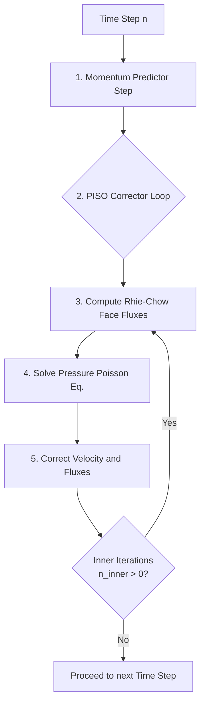
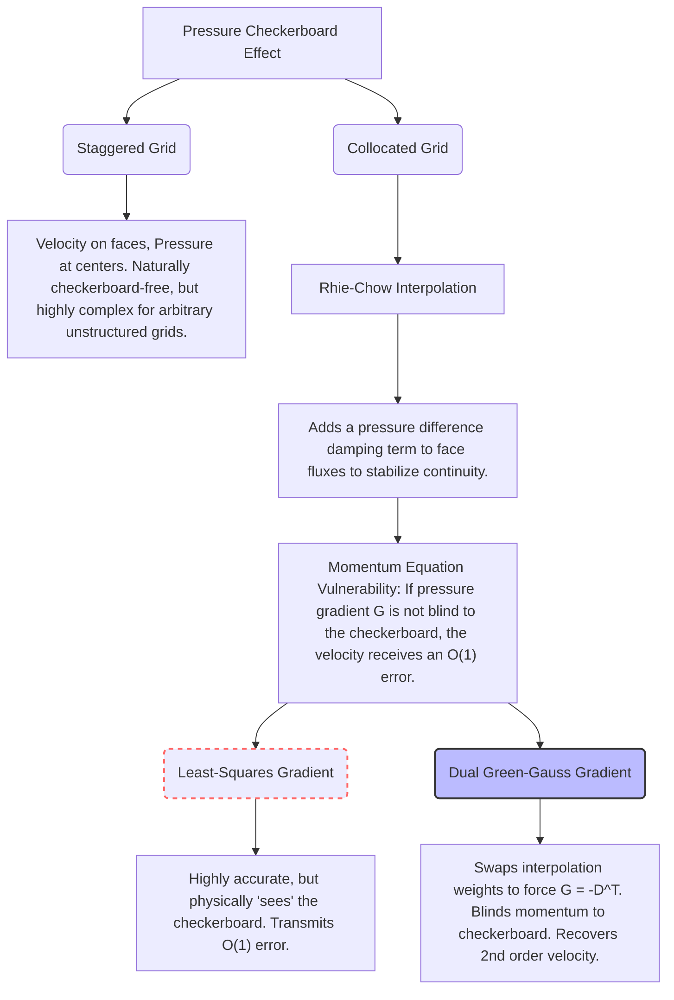

# Collocated PISO Scheme on Unstructured Grids

This document details the formulation of the Pressure-Implicit with Splitting of Operators (PISO) scheme on a collocated, unstructured finite volume grid. It covers the geometric definitions, the Rhie-Chow stabilization required to prevent pressure checkerboarding, non-orthogonal corrections, and boundary conditions.

---

## 1. The Collocated Grid Architecture

In a **collocated grid**, all primary variables (velocity $\vec{u}$, pressure $p$) are stored at the same physical locations: the centroids of the control volumes (cells).

### Geometric Definitions
For any two adjacent cells $P$ and $N$ sharing a face $f$:
- **$\vec{x}_P, \vec{x}_N$**: Cell centroid coordinates.
- **$\vec{x}_f$**: Face centroid coordinates.
- **$\vec{S}_f = A_f \hat{n}_f$**: Face area vector, where $A_f$ is the area and $\hat{n}_f$ is the unit normal pointing from $P$ to $N$.
- **$\vec{d} = \vec{x}_N - \vec{x}_P$**: Distance vector connecting the cell centroids.
- **$w_f = \frac{|\vec{x}_f - \vec{x}_N|}{| \vec{x}_N - \vec{x}_P |}$**: Interpolation weight based on normal-projected distances.

> [!WARNING]
> **The Checkerboard Problem**
> On a collocated grid, the discrete continuity equation requires face velocities, while the momentum equation requires cell-centered pressure gradients. A naive central-difference pressure gradient couples $p_{i-1}$ with $p_{i+1}$, entirely skipping $p_i$. This allows a highly oscillatory "checkerboard" pressure field to perfectly satisfy the discrete equations with zero apparent gradient, destroying the solution. 

---

## 2. PISO Algorithm Overview

The PISO algorithm decouples the velocity and pressure fields by predicting a velocity field without knowing the exact pressure, and then iteratively correcting both fields to satisfy mass conservation (continuity).

---

## 3. The Predictor Step (Momentum)

We discretize the momentum equation implicitly for the new velocity $\vec{u}^*$. For a cell $P$:

$$ a_P \vec{u}_P^* + \sum_N a_N \vec{u}_N^* = \vec{H}_P - V_P (\nabla p^{n-1})_P $$

Where:
- $a_P$ is the central diagonal coefficient (representing inertia and diffusion).
- $a_N$ are the neighbor coefficients.
- $\vec{H}_P$ contains explicit source terms and the transient history.
- $V_P$ is the cell volume.
- $\nabla p$ is the cell-centered pressure gradient.

From this, the velocity can be isolated algebraically:
$$ \vec{u}_P^* = \frac{\vec{H}_P - \sum_N a_N \vec{u}_N^*}{a_P} - \frac{V_P}{a_P} (\nabla p^{n-1})_P $$

### Time Discretisation and the Convecting Flux

The transient term is BDF2 ($a_t = 3/(2\Delta t)$, history $2\vec{u}^n - \tfrac12 \vec{u}^{n-1}$), BDF1 on the first step. The convection coefficients $a_N$ are built from a face mass flux, and **which** flux matters for the temporal order:

$$ F_f^{\,conv} = 2 F_f^{\,n} - F_f^{\,n-1} \quad\text{(second-order extrapolation to } t^{n+1}\text{)} $$

Using the flux at the start of the step, $F_f^{\,n}$, is a first-order-in-time linearisation of the convecting velocity. It is invisible on any convection-free test (the unsteady Stokes gate T4 measured order 2.3-2.7 with it) and was caught only by the Orr-Sommerfeld gate T8, where the phase speed of the unstable mode converged at order 1.00 in $\Delta t$. With the extrapolated flux the T8 results are $\Delta t$-independent to the third digit, and the cylinder's shedding forces stop moving between $\Delta t = 0.01$ and $0.005$ (the lagged version converges to them at first order). `PISO.conv_flux_extrap` (default on) selects this; the Rhie-Chow corrector still uses $F^n$ for its time-step-independent damping term, which is a different role.

> [!NOTE]
> The lift-amplitude change on the cylinder at $\Delta t = 0.01$ was 5%, not the fraction of a percent one might guess from $\omega \Delta t \approx 0.01$: the relevant time scale for the linearisation error is the near-wall convective one, $h/u \sim 0.024$, i.e. a local CFL of about 0.4.

---

## 4. Rhie-Chow Interpolation (Interface Fluxes)

To enforce continuity, we need the mass flux at the face: $F_f = \vec{u}_f \cdot \vec{S}_f$.
Naive linear interpolation of the cell velocities ($\overline{\vec{u}}_f$) re-introduces the checkerboard mode. **Rhie-Chow interpolation** stabilizes this by interpolating the momentum equation itself to the face, ensuring the flux depends on the *compact* pressure difference across the face.

The stabilized face flux is defined as:
$$ F_f^* = \underbrace{\overline{\vec{u}}_f^* \cdot \vec{S}_f}_{\text{Linear Interpolation}} - \underbrace{D_f \left( \nabla p_{compact} - \overline{\nabla p}_{wide} \right)}_{\text{Rhie-Chow Damping Term}} $$

### The Damping Coefficient ($D_f$)
$D_f$ represents the inverse momentum matrix diagonal interpolated to the face:
$$ D_f = \overline{ \left( \frac{V}{a_P} \right) }_f $$
> [!IMPORTANT]
> $a_P$ **must** be the raw diagonal from the momentum matrix. Using a modified coefficient like the SIMPLEC row-sum ($a_C$) here breaks the exact algebraic substitution from the momentum equation, leading to catastrophic over-damping.

### The Pressure Gradients
The damping term subtracts the wide-stencil gradient and replaces it with a compact, face-normal gradient. On highly skewed grids, directional consistency is paramount:
1. **Wide Gradient**: $\overline{\nabla p}_{wide} = \overline{(\nabla p)}_f \cdot \vec{S}_f$
2. **Compact Gradient**: Built using the **over-relaxed geometric decomposition** ($\vec{S}_f = \vec{E}_f + \vec{T}_f$):
   $$ \nabla p_{compact} = |\vec{E}_f| \frac{p_N - p_P}{|\vec{d}|} + \vec{T}_f \cdot \overline{(\nabla p)}_f $$
   This ensures that the compact and wide gradients represent the exact same directional derivative, avoiding an $\mathcal{O}(1)$ skewness error.

### Discrete Duality ($G = -D^T$)
To completely prevent the checkerboard mode from leaking back into the velocity field, the pressure gradient operator $G$ in the momentum source must be the exact negative transpose of the divergence operator $D$ used in continuity. 
This is achieved by using a **Dual Green-Gauss Gradient** (`GGDualGradient`) which swaps the interpolation weights ($p_f = (1-w)p_P + w p_N$) to force the discrete sum to telescope over the mesh exactly.

---

## 5. The Corrector Step (Pressure Poisson)

We seek a pressure correction $p'$ such that the corrected flux $F_f^{**} = F_f^* - D_f (\nabla p')_f$ is perfectly divergence-free ($\sum F_f^{**} = 0$).

This yields the **Pressure Poisson Equation**:
$$ \sum_{faces} D_f \left( \nabla p' \right)_f = \sum_{faces} F_f^* $$

> [!TIP]
> **SIMPLEC Coefficient ($a_C$)**
> While Rhie-Chow uses $a_P$, the Poisson solver uses the SIMPLEC coefficient $a_C = \max(a_P - \sum a_N, \frac{V_P}{\Delta t})$ to define the diffusivity $\Gamma = V_P / a_C$. Because the viscous terms sum to zero, using $a_P$ directly in the pressure equation severely underestimates the pressure response (by ~92x), causing divergence.

Once $p'$ is found, we correct the fields:
$$ p^{new} = p^{old} + p' $$
$$ F_f^{**} = F_f^* - D_f (\nabla p')_f $$
$$ \vec{u}^{**} = \vec{u}^* - \frac{V}{a_P} \nabla p' $$

### Inner Iterations (`n_inner`)
Because the non-orthogonal cross-diffusion term ($\vec{T}_f \cdot \nabla \phi$) is computed explicitly using the old gradient, lagging it by a time step degrades temporal accuracy to 1st order. PISO executes `n_inner` (typically 2 or 3) loops over the corrector to implicitly converge this cross-term within the time step, restoring 2nd order accuracy in time (BDF2).

---

## 6. Boundary Conditions

### Wall Boundary (Dirichlet Velocity)
At walls, the velocity is fixed (e.g., $\vec{u} = 0$). The mass flux through the wall is exactly defined by the boundary condition.
> [!CAUTION]
> **No Rhie-Chow Damping on Walls!**
> Applying Rhie-Chow damping on a Dirichlet boundary face artificially alters the fixed physical mass flux, creating phantom mass generation that the Poisson solver smears globally. The flux must be strictly $F_{wall} = \vec{u}_{BC} \cdot \vec{S}_f$.

### Wall Forces (post-processing, not discretisation)
The force on a no-slip wall is integrated from the wall pressure (owner-cell value, Neumann) and the wall shear taken from the solver's **own discrete wall flux**, $\tau_w = \nu\, u_P / d_n$ with $d_n$ the centroid-to-wall distance and the tangential derivatives dropped (they vanish at a no-slip wall). Reconstructing the shear from the wall cell's cell-centre gradient reads it $d_n/2$ from the wall and under-predicts the viscous drag by 3% on the cylinder at Re 100; the discrete flux is what the momentum balance actually applied, and it puts the steady drag within 0.3% of HydroGym's converged Taylor-Hood value on two different meshes.

### Periodic Boundaries
Two boundary groups become a periodic seam by pairing faces whose centres differ by the period vector and merging each pair into one interior face: the surviving face keeps its owner, takes the partner's owner as neighbour, and its cell-to-cell vector is $\vec{d} = \vec{x}_{N} - \vec{L} - \vec{x}_{P}$ with $\vec{L}$ the period, so the vector points forward across the seam rather than back across the domain. Every operator that reads geometry through $\vec{d}$, the face weights and $\vec{E}_f, \vec{T}_f$ is then periodic with no further change; the only operators that had to be touched were two that read the neighbour centroid directly. Because the seam faces are ordinary interior faces, there are no ghost cells and the pressure Poisson system keeps its single null vector (`Mesh.make_periodic`).

### Dong Outflow Boundary Condition
Open boundaries are notoriously unstable when vortices exit the domain, as localized backflow (inflow) can drag kinetic energy back into the system, causing the solver to blow up.

The **Dong Outflow Condition** (Dong et al., JCP 2014) robustly stabilizes open boundaries by acting as a directional valve:
$$ \nu \frac{\partial \vec{u}}{\partial n} - p \hat{n} = -\frac{1}{2} |\vec{u}|^2 S_0(\vec{u} \cdot \hat{n}) \hat{n} $$

Where $S_0(x)$ is a smoothed step function that activates only during backflow:
$$ S_0(x) = \frac{1}{2} \left( 1 - \tanh\left(\frac{x}{U_0}\right) \right) $$

- **When fluid enters ($\vec{u} \cdot \hat{n} < 0$)**: $S_0 \approx 1$, applying a heavy artificial dynamic pressure penalty that suppresses the incoming kinetic energy and forces the vortex to cleanly leave the domain without destabilizing the global solve.

---

## 7. The Crucial Role of the Green-Gauss Gradient (Duality vs. Consistency)

A defining characteristic of this solver is the explicit prioritization of **discrete mass-momentum duality** over pointwise numerical consistency. This design choice was the result of extensive investigation into the $\mathcal{O}(1)$ error floor observed on unstructured steady Stokes flow.

### The Checkerboard Transmission Problem
In standard collocated Finite Volume schemes, Rhie-Chow interpolation prevents the checkerboard pressure mode from contaminating the *continuity* equation. However, the momentum equation still requires a cell-centered pressure gradient. 
If the discrete pressure gradient operator ($G$) is not precisely the negative transpose of the discrete divergence operator ($D$), the momentum equation is not "blind" to the checkerboard mode. 

### Why Least-Squares (LSQ) Fails
Most modern unstructured solvers default to Least-Squares (LSQ) gradients because they guarantee 1st or 2nd-order spatial consistency on arbitrary meshes. 

Mathematically, the LSQ gradient seeks a constant gradient vector $\nabla p_P$ at cell $P$ that minimizes the weighted sum of squared errors between the extrapolated and actual neighbor values:
$$ E = \sum_N w_N \left( p_N - (p_P + \nabla p_P \cdot \vec{d}_{PN}) \right)^2 $$
Minimizing $E$ yields a precise geometric tensor that computes a highly accurate local gradient. 

However, because LSQ is highly accurate, it physically "sees" the high-frequency checkerboard pressure mode and computes its gradient perfectly. This transmits the checkerboard error directly into the velocity field as an $\mathcal{O}(1)$ momentum source term, completely destroying velocity convergence (resulting in a hard 0th-order error floor).

### The Dual Green-Gauss Solution ($G = -D^T$)
To cure this, the solver abandons the consistent LSQ gradient in favor of a **Dual Green-Gauss Gradient** (`GGDualGradient`). 

The standard Green-Gauss gradient computes the gradient via the divergence theorem over the cell volume $V_P$:
$$ \nabla p_P = \frac{1}{V_P} \sum_{faces} p_f \vec{S}_f $$
The face pressure $p_f$ is typically interpolated using the standard distance-based geometric weight $w_f = \frac{|\vec{x}_f - \vec{x}_N|}{|\vec{d}_{PN}|}$:
$$ p_{f,\text{standard}} = w_f p_P + (1 - w_f) p_N $$
However, inserting this standard interpolation into the sum does **not** yield a gradient operator $G$ that is the exact negative transpose of the divergence operator $D$.

By explicitly **swapping** the geometric interpolation weights:
$$ p_{f,\text{dual}} = (1 - w_f) p_P + w_f p_N $$
the Green-Gauss gradient is forced to telescope exactly across the mesh. This mathematically guarantees $G = -D^T$. 
Because the collocated divergence operator is inherently blind to the checkerboard mode, the dual $G$ operator is identically blind to it as well. The checkerboard mode is trapped entirely within the pressure field, allowing the velocity field to cleanly converge at **2nd order**.

### The Arbitrary Triangle Trade-off
Extensive effort was spent studying this gradient on arbitrary triangles because the swapped-weight Green-Gauss formulation is mathematically **$\mathcal{O}(0)$ inconsistent** on non-orthogonal, unstructured meshes. The face value approximation is strictly incorrect unless the adjacent cells are perfect mirror images.
The rigorous testing campaign was required to prove that this severe local truncation error does not ruin the global solution. The data ultimately proved that:
1. On structured/clustered quads (up to $\beta = 2.0$), the duality dominates, and velocity achieves perfect 2nd-order accuracy.
2. The local $\mathcal{O}(0)$ inconsistency error scales as $\frac{r-1}{2(r+1)}$ (where $r$ is the stretching ratio) and smoothly vanishes under mesh refinement.
3. Therefore, trading pointwise consistency (LSQ) for exact global duality (Green-Gauss) is strictly required to achieve a functioning 2nd-order collocated solver.
