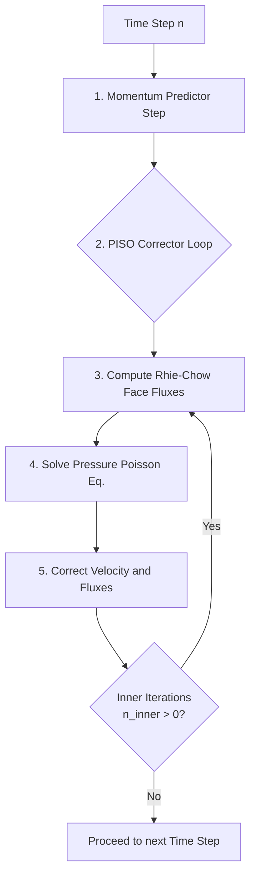

# Collocated PISO Scheme on Unstructured Grids

This document details the formulation of the Pressure-Implicit with Splitting of Operators (PISO) scheme on a collocated, unstructured finite volume grid. It covers the geometric definitions, the Rhie-Chow stabilization required to prevent pressure checkerboarding, non-orthogonal corrections, and boundary conditions.

---

## 1. The Collocated Grid Architecture

In a **collocated grid**, all primary variables (velocity $\vec{u}$, pressure $p$) are stored at the same physical locations: the centroids of the control volumes (cells).

### Geometric Definitions
For any two adjacent cells $P$ and $N$ sharing a face $f$:
- **$\vec{x}_P, \vec{x}_N$**: Cell centroid coordinates.
- **$\vec{x}_f$**: Face centroid coordinates.
- **$\vec{S}_f = A_f \hat{n}_f$**: Face area vector, where $A_f$ is the area and $\hat{n}_f$ is the unit normal pointing from $P$ to $N$.
- **$\vec{d} = \vec{x}_N - \vec{x}_P$**: Distance vector connecting the cell centroids.
- **$w_f = \frac{|\vec{x}_f - \vec{x}_N|}{| \vec{x}_N - \vec{x}_P |}$**: Interpolation weight based on normal-projected distances.

> [!WARNING]
> **The Checkerboard Problem**
> On a collocated grid, the discrete continuity equation requires face velocities, while the momentum equation requires cell-centered pressure gradients. A naive central-difference pressure gradient couples $p_{i-1}$ with $p_{i+1}$, entirely skipping $p_i$. This allows a highly oscillatory "checkerboard" pressure field to perfectly satisfy the discrete equations with zero apparent gradient, destroying the solution. 

---

## 2. PISO Algorithm Overview

The PISO algorithm decouples the velocity and pressure fields by predicting a velocity field without knowing the exact pressure, and then iteratively correcting both fields to satisfy mass conservation (continuity).

---

## 3. The Predictor Step (Momentum)

We discretize the momentum equation implicitly for the new velocity $\vec{u}^*$. For a cell $P$:

$$ a_P \vec{u}_P^* + \sum_N a_N \vec{u}_N^* = \vec{H}_P - V_P (\nabla p^{n-1})_P $$

Where:
- $a_P$ is the central diagonal coefficient (representing inertia and diffusion).
- $a_N$ are the neighbor coefficients.
- $\vec{H}_P$ contains explicit source terms and the transient history.
- $V_P$ is the cell volume.
- $\nabla p$ is the cell-centered pressure gradient.

From this, the velocity can be isolated algebraically:
$$ \vec{u}_P^* = \frac{\vec{H}_P - \sum_N a_N \vec{u}_N^*}{a_P} - \frac{V_P}{a_P} (\nabla p^{n-1})_P $$

---

## 4. Rhie-Chow Interpolation (Interface Fluxes)

To enforce continuity, we need the mass flux at the face: $F_f = \vec{u}_f \cdot \vec{S}_f$.
Naive linear interpolation of the cell velocities ($\overline{\vec{u}}_f$) re-introduces the checkerboard mode. **Rhie-Chow interpolation** stabilizes this by interpolating the momentum equation itself to the face, ensuring the flux depends on the *compact* pressure difference across the face.

The stabilized face flux is defined as:
$$ F_f^* = \underbrace{\overline{\vec{u}}_f^* \cdot \vec{S}_f}_{\text{Linear Interpolation}} - \underbrace{D_f \left( \nabla p_{compact} - \overline{\nabla p}_{wide} \right)}_{\text{Rhie-Chow Damping Term}} $$

### The Damping Coefficient ($D_f$)
$D_f$ represents the inverse momentum matrix diagonal interpolated to the face:
$$ D_f = \overline{ \left( \frac{V}{a_P} \right) }_f $$
> [!IMPORTANT]
> $a_P$ **must** be the raw diagonal from the momentum matrix. Using a modified coefficient like the SIMPLEC row-sum ($a_C$) here breaks the exact algebraic substitution from the momentum equation, leading to catastrophic over-damping.

### The Pressure Gradients
The damping term subtracts the wide-stencil gradient and replaces it with a compact, face-normal gradient. On highly skewed grids, directional consistency is paramount:
1. **Wide Gradient**: $\overline{\nabla p}_{wide} = \overline{(\nabla p)}_f \cdot \vec{S}_f$
2. **Compact Gradient**: Built using the **over-relaxed geometric decomposition** ($\vec{S}_f = \vec{E}_f + \vec{T}_f$):
   $$ \nabla p_{compact} = |\vec{E}_f| \frac{p_N - p_P}{|\vec{d}|} + \vec{T}_f \cdot \overline{(\nabla p)}_f $$
   This ensures that the compact and wide gradients represent the exact same directional derivative, avoiding an $\mathcal{O}(1)$ skewness error.

### Discrete Duality ($G = -D^T$)
To completely prevent the checkerboard mode from leaking back into the velocity field, the pressure gradient operator $G$ in the momentum source must be the exact negative transpose of the divergence operator $D$ used in continuity. 
This is achieved by using a **Dual Green-Gauss Gradient** (`GGDualGradient`) which swaps the interpolation weights ($p_f = (1-w)p_P + w p_N$) to force the discrete sum to telescope over the mesh exactly.

---

## 5. The Corrector Step (Pressure Poisson)

We seek a pressure correction $p'$ such that the corrected flux $F_f^{**} = F_f^* - D_f (\nabla p')_f$ is perfectly divergence-free ($\sum F_f^{**} = 0$).

This yields the **Pressure Poisson Equation**:
$$ \sum_{faces} D_f \left( \nabla p' \right)_f = \sum_{faces} F_f^* $$

> [!TIP]
> **SIMPLEC Coefficient ($a_C$)**
> While Rhie-Chow uses $a_P$, the Poisson solver uses the SIMPLEC coefficient $a_C = \max(a_P - \sum a_N, \frac{V_P}{\Delta t})$ to define the diffusivity $\Gamma = V_P / a_C$. Because the viscous terms sum to zero, using $a_P$ directly in the pressure equation severely underestimates the pressure response (by ~92x), causing divergence.

Once $p'$ is found, we correct the fields:
$$ p^{new} = p^{old} + p' $$
$$ F_f^{**} = F_f^* - D_f (\nabla p')_f $$
$$ \vec{u}^{**} = \vec{u}^* - \frac{V}{a_P} \nabla p' $$

### Inner Iterations (`n_inner`)
Because the non-orthogonal cross-diffusion term ($\vec{T}_f \cdot \nabla \phi$) is computed explicitly using the old gradient, lagging it by a time step degrades temporal accuracy to 1st order. PISO executes `n_inner` (typically 2 or 3) loops over the corrector to implicitly converge this cross-term within the time step, restoring 2nd order accuracy in time (BDF2).

---

## 6. Boundary Conditions

### Wall Boundary (Dirichlet Velocity)
At walls, the velocity is fixed (e.g., $\vec{u} = 0$). The mass flux through the wall is exactly defined by the boundary condition.
> [!CAUTION]
> **No Rhie-Chow Damping on Walls!**
> Applying Rhie-Chow damping on a Dirichlet boundary face artificially alters the fixed physical mass flux, creating phantom mass generation that the Poisson solver smears globally. The flux must be strictly $F_{wall} = \vec{u}_{BC} \cdot \vec{S}_f$.

### Dong Outflow Boundary Condition
Open boundaries are notoriously unstable when vortices exit the domain, as localized backflow (inflow) can drag kinetic energy back into the system, causing the solver to blow up.

The **Dong Outflow Condition** (Dong et al., JCP 2014) robustly stabilizes open boundaries by acting as a directional valve:
$$ \nu \frac{\partial \vec{u}}{\partial n} - p \hat{n} = -\frac{1}{2} |\vec{u}|^2 S_0(\vec{u} \cdot \hat{n}) \hat{n} $$

Where $S_0(x)$ is a smoothed step function that activates only during backflow:
$$ S_0(x) = \frac{1}{2} \left( 1 - \tanh\left(\frac{x}{U_0}\right) \right) $$

- **When fluid exits ($\vec{u} \cdot \hat{n} > 0$)**: $S_0 \approx 0$, recovering the standard traction-free outflow condition.
- **When fluid enters ($\vec{u} \cdot \hat{n} < 0$)**: $S_0 \approx 1$, applying a heavy artificial dynamic pressure penalty that suppresses the incoming kinetic energy and forces the vortex to cleanly leave the domain without destabilizing the global solve.
