# Unstructured LES: status, measured rules, open items

*2026-09-25. One page on where the unstructured 2.5D LES solver stands, with the evidence for each
claim. The full record is `skew_unstructured_literature.md` §§48–60 (cited as [§n]); the plan and
its gates are `unstructured_les_plan.md`; the discretisation is `piso_unstructured_formulation.md`;
the GPU package is `tools/a100/README.md`. Figures under `figures/les_status/` are drawn by
`plot_utility/plot_les_status_evidence.py` from the recorded measurements; the others by the
scripts named in the record.*

## What the solver is

`src/upiso25.py` (`PISO25`): the unstructured cell-centred collocated finite-volume scheme in the
x–y plane (quads or triangles, Rhie–Chow, dual Green–Gauss pressure gradient, deferred central
convection with skewness correction), Fourier in a periodic span with 3/2-rule dealiasing, RK3 with
a pressure projection per stage (Le & Moin), WALE or Smagorinsky (`src/usgs.py`), constant-pressure-
gradient or constant-mass-flow forcing, binned statistics, bitwise restart (`src/ustats.py`).
Per-mode implicit systems are solved as one block by PCG with a shared Ruge–Stuben AMG hierarchy
(`src/umodesolve.py`); the whole step runs on CuPy with raw CSR-block kernels (`src/ucuda.py`).

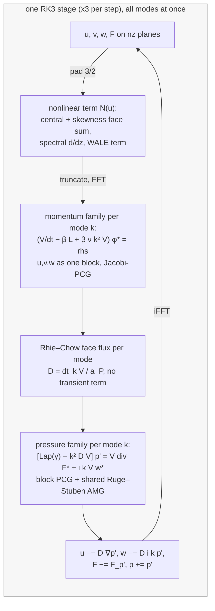

Mode 0 reproduces the 2D solver to 1e-15 [§51], so the 2D validation ladder (T1–T11: Poiseuille,
Stokes, cavity, Orr–Sommerfeld, cylinder, energy conservation) carries over to the plane.

## Gates

| gate | criterion | status |
|---|---|---|
| G0 attribution of energy loss | measure, decide L1a/L1b | passed [§49] |
| G1 RK3 per-stage projection | T4 order, T8, T11 ≤ 0.2%/turnover, T9 within 0.3% | passed on T4/T8/T11; T9 Cl amplitude −1.2% is the dt-independent Rhie–Chow damping BDF2 keeps and RK3 sheds, so the criterion was mis-posed [§50] |
| G2 2.5D solver | TGV energy balance 0.5%, spectral in z, order 2 in plane, cylinder = 2D | passed on all four [§51] |
| G3 SGS | variable-ν order 2, rotation checks, WALE ∝ y³, ν_t reported | passed [§52] |
| G4 solvers and speed | < 30 pressure iterations; ≤ 100 ms per step per 10⁵ cell-modes on the GPU; dt change free | 8–19 iterations; **61–73 ms on the GB10 at every size**, 140 on a real mesh; dt change holds by construction [§57] |
| G5 infrastructure | lossless restart; statistics reproduce an analytic mean | passed [§53] |
| V1 Taylor–Green (Re 800, in-house SEM DNS) | peak time 3%, value 5%, WALE | **value met** (−4.8/−5.2% at 96²/128²), curve rms 5.9% (128² implicit); **time not met**: 6% early at every resolution, orientation-dependent [§58] |
| V2 channel Re_τ 180 (FOSLS DNS) | U⁺ 3%, u_rms 5%, Re_τ 2%, pressure two-colour mode < 1% | **passed on quads**: Re_τ 179.1, U⁺ +1.0%, u_rms −0.3%, −u'v' −1.2%, two-colour 0.00% [§54]. **Fails on every triangle mesh** [§55] |
| Re_τ 395 channel (MKM 1999), 96×160 × 128 modes, A100 | V2 criteria at 2.2× the validation Re | **passed on the near-wall statistics**: Re_τ 393.4, U⁺ +0.6%, u_rms −1.9%, −u'v' −0.9%, two-colour 0.00%; core high above y⁺ 150 = minimal-box limit y ≈ 0.3 L_z [§63] |
| V3 cylinder Re 3900, periodic span | St 3%, C_D 5%, recirculation 10% | not started: needs a Re 3900 mesh; 10–20 h on an A100 for the fine butterfly [§59] |

### Evidence for G1 and G2

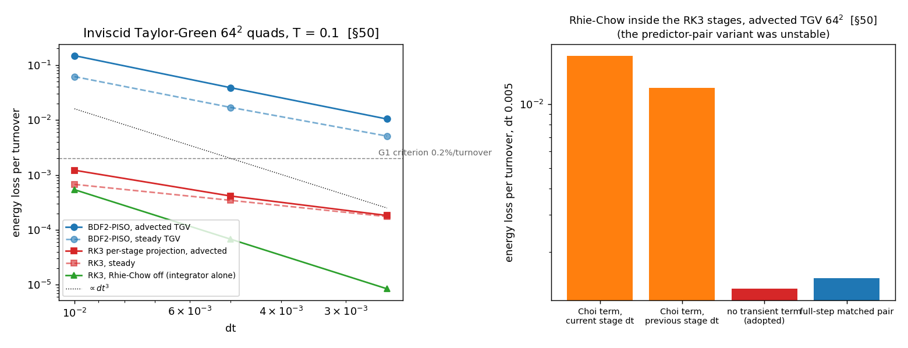

*Left: energy loss per turnover of the inviscid Taylor–Green on 64² quads. BDF2-PISO (blue) loses
4–15% per turnover at the working steps; RK3 with a projection per stage (red) 0.04% at dt 0.005, a
hundred times less; the integrator alone (green, Rhie–Chow off) follows dt³. Right: the Rhie–Chow
treatment inside the RK3 stages — Choi's dt-independent transient term leaves a dt-independent
1.2–1.7% floor whichever stage step it uses; the plain O(dt) damping (adopted) does not [§50].*

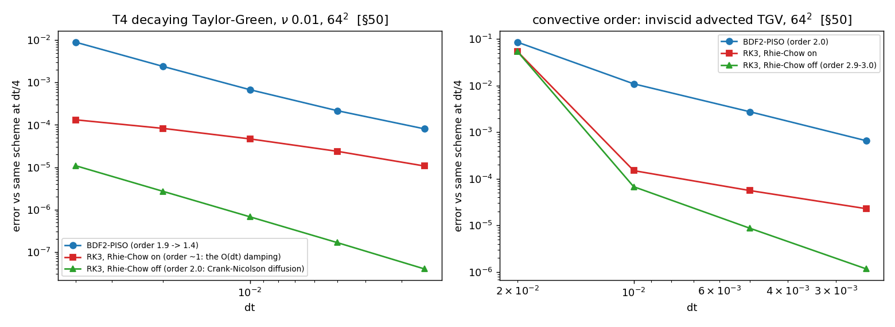

*T4 temporal order against the same scheme at dt/4: RK3 is third order in convection (right, green,
2.9–3.0) and second in diffusion (left, Crank–Nicolson); with Rhie–Chow on, the O(dt) stage damping is
the leading dt-dependence once the integrator's error drops below it, still 50× below BDF2 [§50].*

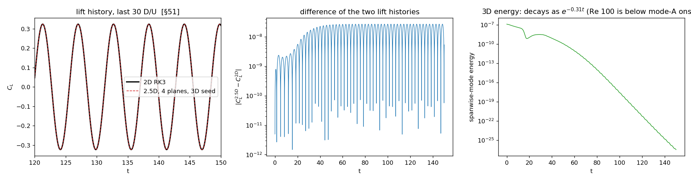

*G2's fourth test: the periodic-span cylinder at Re 100 with a 3D seed reproduces the 2D RK3 lift
history to 1e-8 (the solver's own tolerance) and the seeded spanwise energy decays as e^(−0.31 t) to
1e-27 — the 3D machinery runs for 30,000 steps without feeding anything back into mode 0 [§51].*

### Evidence for V2 and the triangle verdict

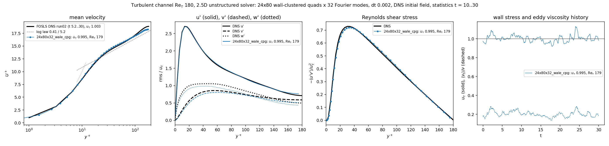

*Channel Re_τ 180, 24×80 wall-clustered quads × 32 modes, WALE, constant pressure gradient, 99
flow-throughs of statistics, against the SEM FOSLS DNS: mean profile within 0.15 u_τ in the log
region, u_rms peak −0.3%, shear stress −1.2%; u_τ (right, solid) wanders about 1 as a minimal channel
does, ⟨ν_t⟩/ν (dashed) at 0.19 [§54].*

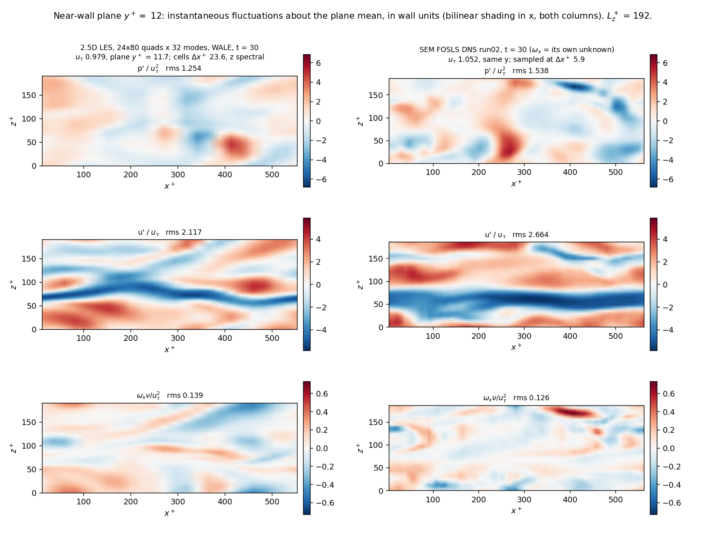

*The same run's instantaneous planes at y⁺ ≈ 12 against the FOSLS field at the same time: pressure,
streamwise velocity and streamwise vorticity fluctuations. The same streaks, pressure patches and
vortex streaks, ours at the LES resolution; no period-2 content in either [§54].*

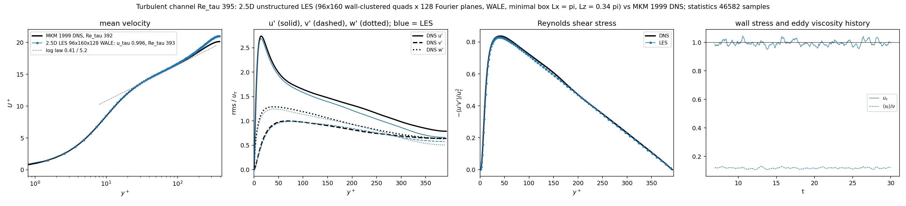

*Re_τ 395 on the A100: 96×160 quads × 128 modes, WALE, ten flow-throughs of statistics, against MKM
1999. Re_τ 393.4, U⁺ within 0.17 u_τ in the log region, u_rms peak −1.9%, shear stress −0.9%; the
core runs high above y⁺ ≈ 150 because the minimal box (L_z ≈ 1.07h) only reproduces the full channel
below y ≈ 0.3 L_z (Flores & Jiménez 2010), and that is y⁺ 125 here [§63].*

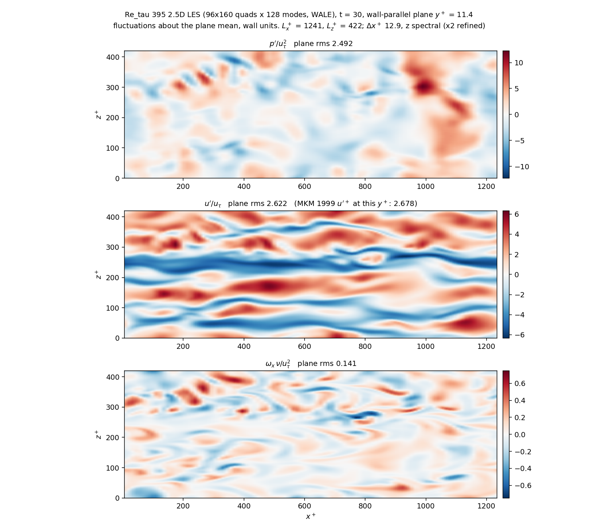

*The Re_τ 395 field at t = 30, plane y⁺ 11: four low-speed streaks across L_z⁺ 422 — a spacing of
about 100 wall units, the DNS value — with the pressure patches and the streamwise-vorticity pairs
that flank them; plane u' rms 2.62 against MKM's 2.68 [§63].*

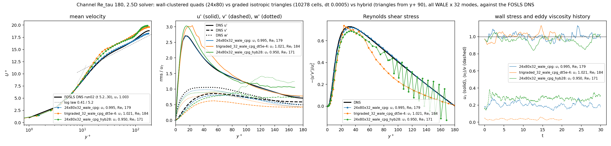

*Why quads: the same case on isotropic graded triangles (orange) and on a hybrid mesh with triangles
from y⁺ 90 (green). The hybrid's Reynolds stress zigzags bin to bin across its triangle core while its
quad layers sit on the DNS — the two-colour mode of a non-bipartite mesh, in the velocity statistics.
The graded triangles run but the bulk velocity drifts +14% while τ_w ≈ f, so the discrete momentum
balance does not close; U⁺ +1.2 u_τ, v_rms −27% [§55].*

### Evidence for V1

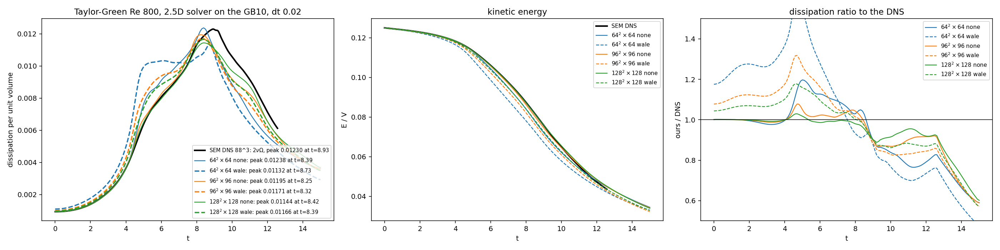

*Taylor–Green Re 800, 64/96/128 planes × modes, no model (solid) and WALE (dashed), against the SEM
DNS (black), full history. The 128² implicit run tracks the DNS within 1–2% to t = 7.5, then peaks
0.5 early and sits 10–20% low; WALE over-dissipates the laminar phase (the shoulder at t 4.5–6) at
every resolution [§58].*

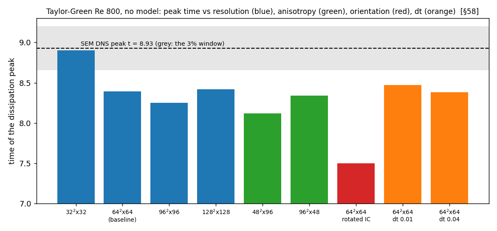

*What moves the peak time and what does not: resolution (blue) does not converge it, dt (orange)
does not touch it, but rotating the initial condition so the span carries a different velocity
component (red) moves it by 0.9 — the plane's second-order dispersion, not the model, sets it [§58].*

### Evidence for G4

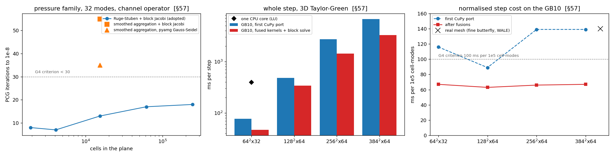

*Left: PCG iterations to 1e-8 for the 32-mode pressure family on the wall-clustered channel operator —
classical Ruge–Stuben coarsening (8–19 up to 2.5×10⁵ cells) against smoothed aggregation (35–55).
Middle and right: the whole step on the GB10 before and after the fused shifted-matvec/Jacobi kernels,
the u–v–w block solve and the cuBLAS reductions; the normalised cost sits at 61–73 ms per 10⁵
cell-modes at every size, inside the G4 bar, and at 140 on a real stretched mesh with WALE [§57].*

## Design rules, measured

1. **RK3 with a projection per stage is the LES integrator.** Energy loss 0.04%/turnover against
   3.9% for BDF2-PISO at dt 0.005 (figure above) [§50]. BDF2-PISO remains the default for laminar 2D
   cases only.
2. **No dt-independent Rhie–Chow transient term inside RK3.** It left a 1.2–1.7%/turnover floor;
   the plain O(dt) stage damping vanishes with the step (figure above, right) [§50].
3. **Quads for wall-bounded LES.** Split quads and hybrid triangle cores diverge or carry 14% of the
   pressure rms in the two-colour mode with a zigzag Reynolds stress; isotropic graded triangles
   run but the bulk velocity drifts +14% while τ_w ≈ f, U⁺ +1.2 u_τ, v_rms −27% (figure above) [§55].
   Triangles stay in laminar external flow with vertex-averaged post-processing.
4. **WALE with Δ = (V δz)^{1/3}** gives the channel within 1% [§54] but over-dissipates the laminar
   phase of a transition (ν_t/ν ≈ 0.8 on the laminar TGV field, the shoulder at t 4.5–6) [§58]. The
   σ-model, which vanishes for laminar and 2D states, is the port to make before transitional cases.
5. **Second-order in-plane convection advances a transition**: the TGV breakdown comes 6% early at
   every resolution and moves 0.9 time units when the initial condition is rotated (figure above)
   [§58]. Only a fourth-order in-plane reconstruction changes that.
6. **Spanwise dealiasing is mandatory**: without it the TGV is unusable by t = 5 (negative
   dissipation) [§58].
7. **The in-house "Re 1600" TGV reference is the Re 800 SEM file** (`results/tgv_diag_re800_88.npz`,
   ν = 1/800: its initial dissipation is twice a Re 1600 field's); V1 is judged at Re 800 against its
   full history [§58].

## Cost

| GB10 | ms/step | per 10⁵ cell-modes |
|---|---|---|
| TGV 128²×64 | 340 | 63 |
| TGV 384²×64 | 3,275 | 67 |
| fine butterfly 27,968 quads × 64 modes, WALE | 1,290 | 140 |
| channel Re_τ 395, 96×160 × 128 modes | ~1,400 (A100 measured: 380–440) | ~140 (A100: 20–22) |

Launch floor ~46 ms per step; the nonlinear term is now 40% of the step. The first A100 profile
(before the last optimisation) gave 47.6 ms per 10⁵ cell-modes at 384²×64 behind a 237 ms launch
floor; rerun `tools/a100/profile_step.py` after pulling.

## Open items (in order)

1. Port the σ-model; gate: TGV Re 800 curve rms at 96²×96 below the implicit run's.
2. ~~Run the Re_τ 395 channel on the A100~~ — done 2026-09-26 [§63]: all V2 criteria met on the near-wall
   statistics (`figures/uchannel_re395_profiles.png`, `_nearwall_yp12.png`, `_spectra.png`); the outer layer
   is the minimal box's, a full 2π × π box (8× the cost) is the check if it ever matters.
3. Fuse the nonlinear term's padded-plane gathers on the GPU. (CFL-adaptive stepping done 2026-09-25 [§61]: `--cfl-max`, face-flux Courant number, dt halves up to three times; the Re_τ 395 run at fixed dt 0.001 diverged at C ≈ 1.2 after ten time units.)
4. A Re 3900 cylinder mesh (wall cell ~0.002 D, 10⁵ cells) for V3.
5. Fourth-order in-plane reconstruction, only if a transition's peak timing becomes a criterion.

## Side result: the NACA0012 gust-control task (HydroGym's AoA 40 case) on our solver

`src/ujets.py`, `naca_env.py`, `train_naca_ppo.py` [§56]: three leading-edge jets as HydroGym's m-AIA
files define them, PPO with 8 environments on the Spark. 200k steps; the deterministic policy scores −30.3 against −64.2 for doing nothing (+53%) and cuts the lift
excursion during the gust by 70%; the policy is gust-reactive: suction on the upper-surface jet ramped to 0.4 U∞ and blowing on the
lower jet at the gust peak, holding C_L within 5% of its target while the free stream doubles (`figures/naca40_gust_control_eval.png`, `figures/naca40_gust_control_fields.png`).

## Not doing

TVD or limited convection in the LES momentum equations; triangles or tetrahedra for wall-bounded
LES; iterating the dual Green–Gauss gradient (its inconsistency is confined to the momentum
pressure term and measured harmless [§§16–24]; the triangle failure is a different mechanism);
max(Δx, Δy, Δz) as the filter width (it increases ν_t; the channel result does not ask for it) [§60].
